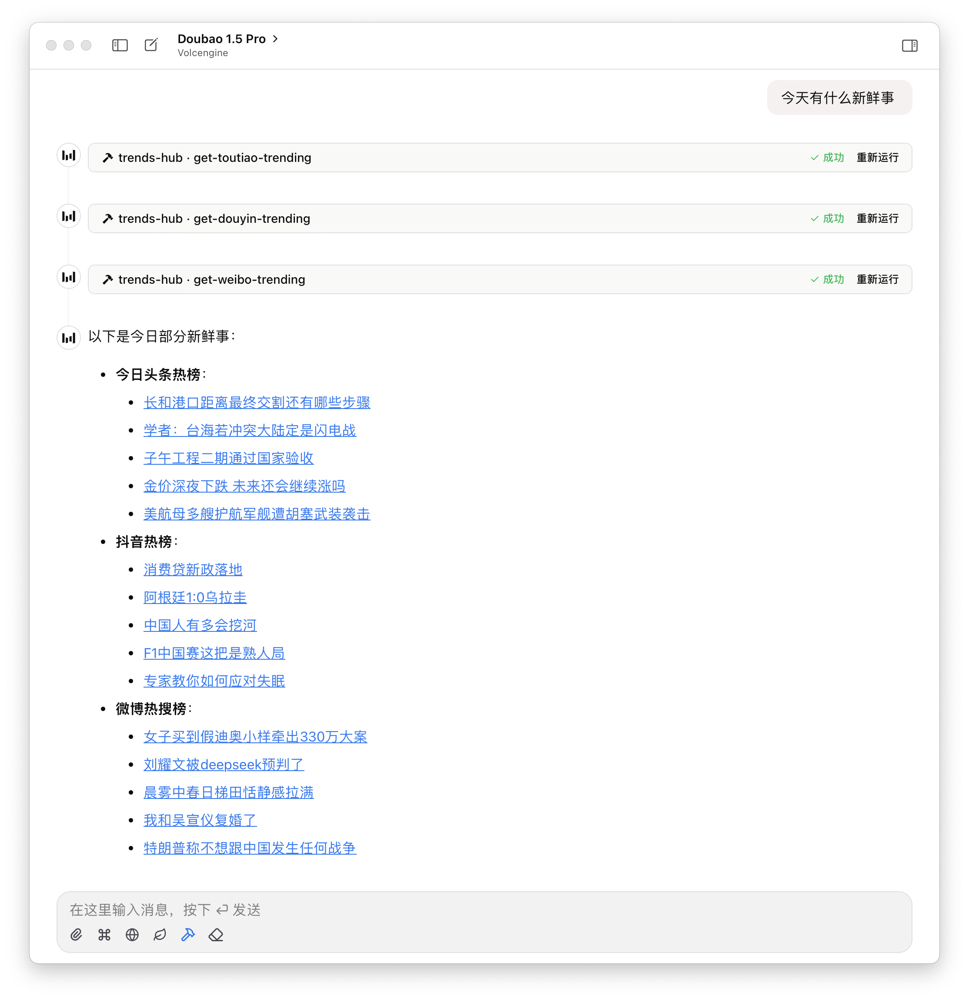

# 🔥 Trends Hub

[](https://smithery.ai/server/@baranwang/mcp-trends-hub)
[](https://www.npmjs.com/package/mcp-trends-hub)


基于 Model Context Protocol (MCP) 协议的全网热点趋势一站式聚合服务

## 示例效果

<picture>
  <source media="(prefers-color-scheme: dark)" srcset="./assets/case-dark.png">
  
</picture>

## ✨ 特性

- 📊 **一站式聚合** - 聚合全网热点资讯，20+ 优质数据源
- 🔄 **实时更新** - 保持与源站同步的最新热点数据
- 🧩 **MCP 协议支持** - 完全兼容 Model Context Protocol，轻松集成到 AI 应用
- 🔌 **易于扩展** - 简单配置即可添加自定义 RSS 源
- 🎨 **灵活定制** - 通过环境变量轻松调整返回字段

## 📖 使用指南

首先需要了解 [MCP](https://modelcontextprotocol.io/introduction) 协议，然后按照以下配置添加 Trends Hub 服务

不同的 MCP 客户端实现可能有所不同，以下是一些常见的配置示例：

### JSON 配置

<!-- usage-json-start -->
```json
{
  "mcpServers": {
    "trends-hub": {
      "command": "npx",
      "args": [
        "-y",
        "mcp-trends-hub@1.6.2"
      ]
    }
  }
}
```

<!-- usage-json-end -->

### 命令行配置

<!-- usage-bash-start -->
```bash
npx -y mcp-trends-hub@1.6.2
```

<!-- usage-bash-end -->

### 安装

#### 使用 Smithery 安装

通过 [Smithery](https://smithery.ai/server/@baranwang/mcp-trends-hub) 安装 Trends Hub，适用于 Claude Desktop 客户端：

```bash
npx -y @smithery/cli install @baranwang/mcp-trends-hub --client claude
```

（以下仅适用于 MCP 模型客户端）

### 配置环境变量

### `TRENDS_HUB_HIDDEN_FIELDS` - 隐藏的字段列表

通过此环境变量可控制返回数据中的字段显示：

- 作用于所有工具：`{field-name}`，例如 `cover`
- 作用于特定工具：`{tool-name}:{field-name}`，例如 `get-toutiao-trending:cover`

多个配置用西文逗号分隔，例如：

```jsonc
{
  "mcpServers": {
    "trends-hub": {
      "command": "npx",
      "args": ["-y", "mcp-trends-hub"],
      "env": {
        "TRENDS_HUB_HIDDEN_FIELDS": "cover,get-nytimes-news:description" // 隐藏所有工具的封面返回和纽约时报新闻的描述
      }
    }
  }
}
```

### `TRENDS_HUB_CUSTOM_RSS_URL` - 自定义 RSS 订阅源

Trend Hub 支持通过环境变量添加自定义 RSS 源：

```jsonc
{
  "mcpServers": {
    "trends-hub": {
      "command": "npx",
      "args": ["-y", "mcp-trends-hub"],
      "env": {
        "TRENDS_HUB_CUSTOM_RSS_URL": "https://news.yahoo.com/rss" // 添加 Yahoo 新闻 RSS
      }
    }
  }
}
```

配置后将自动添加`custom-rss`工具，用于获取指定的 RSS 订阅源内容

## 🛠️ 支持的工具

<!-- tools-start -->
| Tool Name | Description |
| --- | --- |
| get-36kr-trending | Get 36Kr trending topics, providing startup, business, and tech industry hot topics, including investment dynamics, emerging industry analysis, and business model innovation information |
| get-9to5mac-trending | Get 9to5Mac Apple-related news, including Apple product launches, iOS updates, Mac hardware, app recommendations, and Apple company updates |
| get-bbc-trending | Get BBC news, providing global news, UK news, business, politics, health, education, technology, entertainment, and more |
| get-bilibili-trending | Get Bilibili video rankings, including popular videos from various sections like animation, music, gaming, reflecting current youth content consumption trends |
| get-douban-trending | Get Douban real-time hot lists, providing current popular books, movies, TV shows, variety shows, and other works with ratings and popularity data |
| get-douyin-trending | Get related information |
| get-gcores-trending | Get related information |
| get-ifanr-trending | Get iFanr tech news, including latest tech products, digital devices, internet trends, and cutting-edge tech information |
| get-infoq-trending | Get related information |
| get-juejin-trending | Get related information |
| get-netease-news-trending | Get NetEase news hot topics, including political news, social events, financial information, tech trends, and entertainment sports comprehensive Chinese news |
| get-nytimes-trending | Get New York Times news, providing authoritative English news in global politics, economy, technology, culture, and other fields |
| get-smzdm-trending | Get SMZDM hot topics, including product recommendations, discount information, shopping guides, product reviews, and consumer experience sharing practical Chinese consumer information |
| get-sspai-trending | Get SSPAI hot rankings, including digital product reviews, software recommendations, lifestyle guides, and efficiency work tips quality Chinese tech lifestyle content |
| get-tencent-news-trending | Get related information |
| get-thepaper-trending | Get ThePaper news hot topics, including political news, financial trends, social events, cultural education, and in-depth reporting high-quality Chinese news |
| get-theverge-trending | Get The Verge news, including tech innovation, digital product reviews, internet trends, and tech company dynamics English tech information |
| get-toutiao-trending | Get Toutiao hot topics, including political news, social events, international news, tech development, and entertainment gossip multi-domain hot Chinese information |
| get-weibo-trending | Get Weibo hot search rankings, including current events, social phenomena, entertainment news, celebrity updates, and trending topics real-time hot Chinese information |
| get-weread-trending | Get WeChat Reading rankings, including popular books, new book recommendations, novel lists, and other reading content, reflecting current reading trends |
| get-zhihu-trending | Get Zhihu hot topics, including current events, social topics, tech trends, entertainment gossip, and other multi-domain hot Q&A and discussion Chinese information |


<!-- tools-end -->

更多数据源正在持续增加中

## 鸣谢

- [DailyHotApi](https://github.com/imsyy/DailyHotApi)
- [RSSHub](https://github.com/DIYgod/RSSHub)
